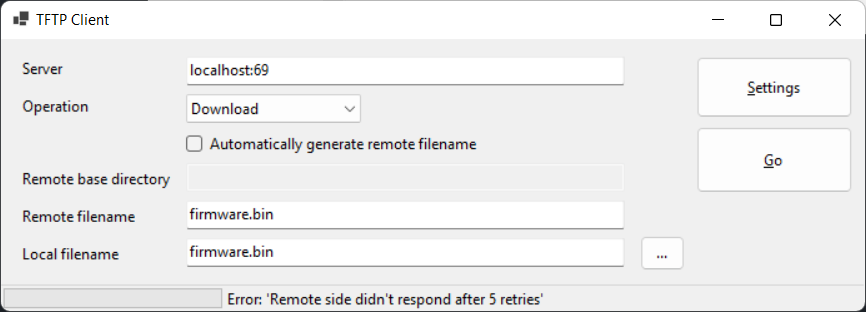

# TFTPClient

Managed TFTP client implementation, written in C#. Supports:
- IPv4 and IPv6
- correct retry behavior.
- TFTP options: block size, transfer size, and timeout.
- unlimited transfer sizes
- permissive license for commercial use.
- contains an easy to use library and a command line client

See the wikipage [Documentation](docs/Documentation.md) for more information on how to use the library from your own code.

Here's the help page from the command line utility:

    TFTPClient 1.0.0
    Transfers files to and from a remote computer running the TFTP service.

    Usage: TFTPClient [options]+ host[:port]

      --get                  get a file from remote to local
      --put                  put a file from local to remote
      --local=VALUE          local filename
      --remote=VALUE         remote filename
      --serverport=VALUE     override server port (default: 69)
      --blocksize=VALUE      set blocksize (default: 512)
      --timeout=VALUE        set response timeout [s](s) (default: 2)
      --retries=VALUE        set maximum retries (default: 5)
      --verbose              generate verbose tracing
      --ipv6                 resolve hostname to an ipv6 address
      --dontfragment         don't allow packet fragmentation (default: allowed)

      --silent               don't show progress information
      --ttl=VALUE            set time to live
      -?, -h, --help         show help

Screenshot of TFTP Client desktop application:

<!--- these don't size correctly ... boooh

--->

I'm also working on a cross platform desktop UI client, using Avalonia (tested on Win11 and Linux). It's in a separate repository located here: [https://github.com/jpmikkers/Avalonia-TFTPClient](https://github.com/jpmikkers/Avalonia-TFTPClient)

